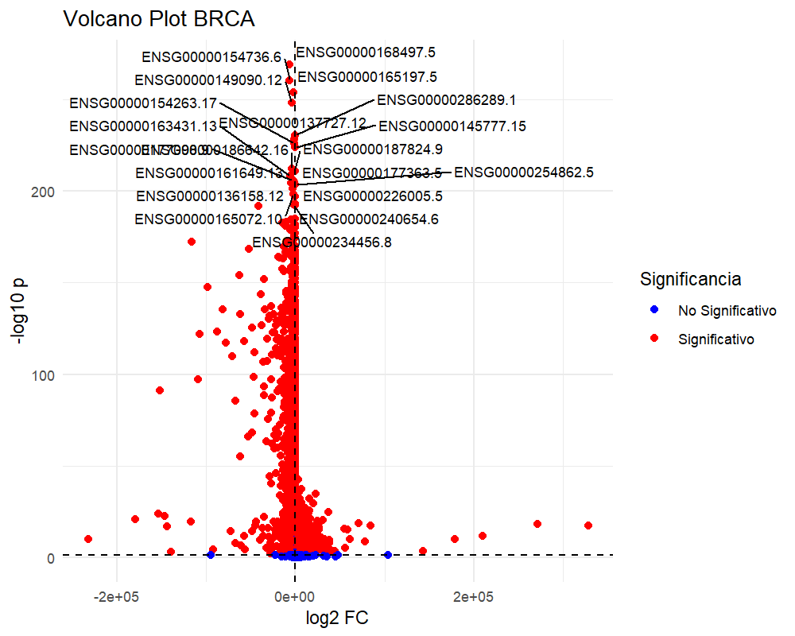
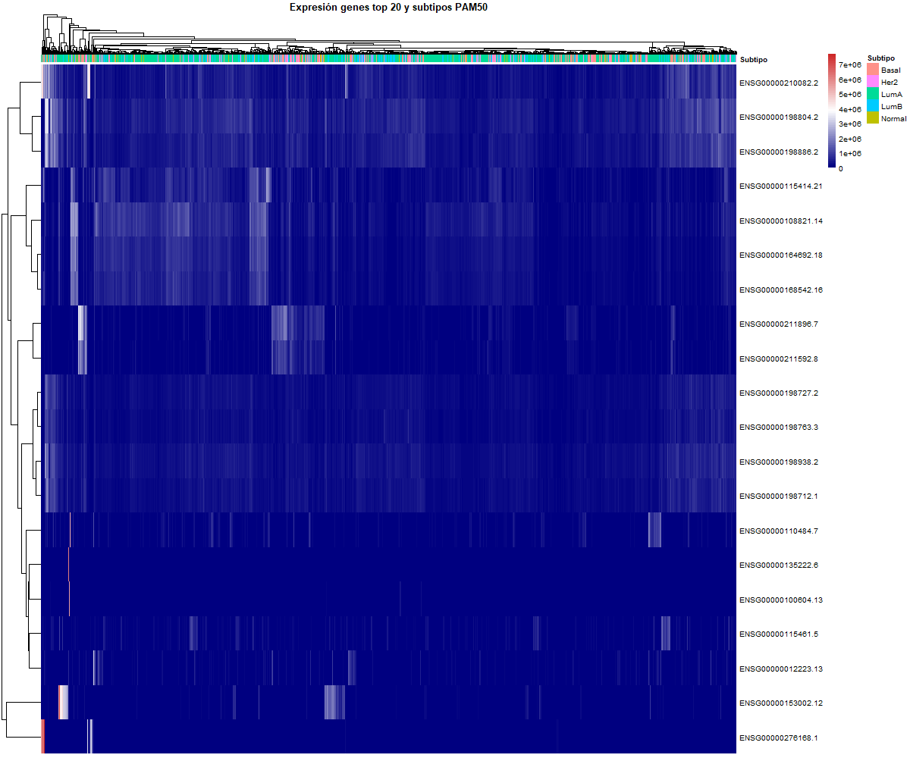
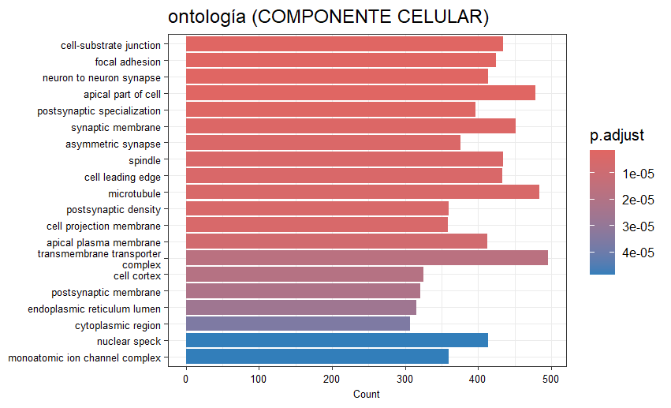
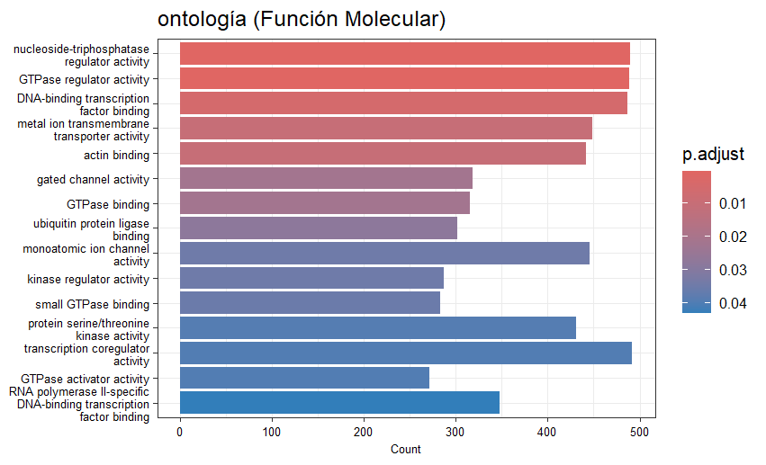
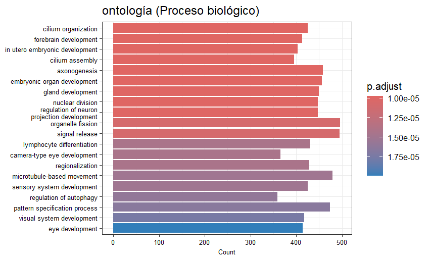
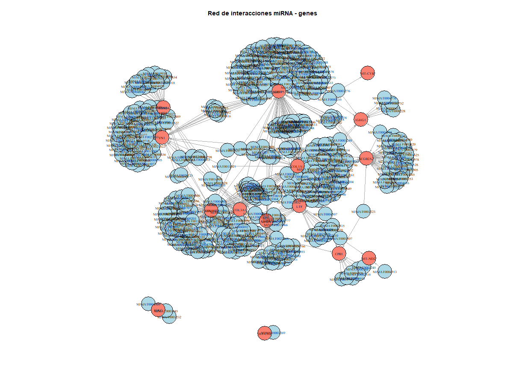
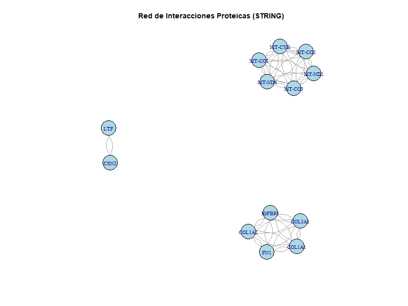

```{r setup, include=FALSE}
knitr::opts_chunk$set(echo = TRUE)
```

# Introducción

El cáncer de mama (BRCA) es una de las principales causas de muerte por
cáncer en mujeres a nivel mundial. Comprender los perfiles de expresión
génica asociados a sus distintos subtipos moleculares permite avanzar
hacia una medicina personalizada, mejorando el diagnóstico, pronóstico y
tratamiento. En este análisis utilizamos datos del consorcio TCGA para
explorar la expresión génica diferencial entre tejido tumoral y normal,
identificar genes clave y relacionarlos con los subtipos PAM50 del
cáncer de mama.

En este análisis usamos un conjunto de librerías de R que nos permiten
manejar datos genómicos, realizar análisis estadísticos, visualizar
resultados y generar interpretaciones biológicas. A continuación, se
destacan algunas de las más importantes:

#### Algunas de las librerías utilizadas fueron:

-   **`TCGAbiolinks`**: Permite acceder a los datos del consorcio TCGA
    directamente desde R. Usamos esta librería para descargar y preparar
    los datos de expresión génica del cáncer de mama.

-   **`ggplot2`**: Librería esencial para crear gráficos de alta
    calidad. En este proyecto la usamos para construir el *volcano plot*
    que resume los genes más importantes.

-   **`pheatmap`**: Utilizada para generar mapas de calor que muestran
    patrones de expresión génica y su relación con los subtipos
    moleculares.

-   **`clusterProfiler`** y **`org.Hs.eg.db`**: Utilizadas para análisis
    de enriquecimiento funcional y anotación biológica, asociando genes
    con rutas metabólicas, procesos biológicos y funciones moleculares.

-   **`edgeR`**: Paquete especializado en el análisis de expresión
    diferencial a partir de datos de RNA-Seq. En este proyecto lo usamos
    para normalizar la matriz de expresión génica y preparar los datos
    para identificar genes relevantes.

-   **`limma`**: Herramienta potente para análisis estadístico de datos
    de expresión. En este caso, fue clave para aplicar modelos lineales
    y generar los resultados usados en el volcano plot.

-   **`DESeq2`**: Usada para el análisis de expresión diferencial en
    RNA-Seq. Aunque no se usó directamente en el volcano plot, es una
    alternativa por la carga de capacidad de manejo robusto de datos.

-   **`igraph`**: Utilizada para crear y analizar redes biológicas. Se
    incluye en el entorno de trabajo por su utilidad al visualizar
    relaciones entre genes.

-   **`STRINGdb`:** Paquete para obtener y visualizar redes de
    interacción proteína-proteína, útil para entender relaciones
    funcionales entre genes.

## Carga y origen de los datos

Para este proyecto se trabajó con datos transcriptómicos del estudio
**TCGA-BRCA (The Cancer Genome Atlas - Breast Invasive Carcinoma)**, uno
de los recursos más completos y accesibles para estudios moleculares de
cáncer de mama. La obtención de los datos se realizó mediante el paquete
`TCGAbiolinks`, que permite acceder al repositorio **Genomic Data
Commons (GDC)**. Se descargaron específicamente datos de **RNA-Seq**,
procesados con el pipeline **STAR - Counts**, correspondientes a
muestras de **tumor primario** y **tejido normal sólido**.

A continuación, se muestra el script que fue utilizado para consultar,
descargar y preparar los datos, aunque este paso no se ejecuta en este
documento por el peso de los archivos:

```{r, eval=FALSE}
# Consulta a la base de datos TCGA
query1 <- GDCquery(project = "TCGA-BRCA",
                   data.category = "Transcriptome Profiling",
                   data.type = "Gene Expression Quantification",
                   workflow.type = "STAR - Counts",
                   sample.type = c("Primary Tumor", "Solid Tissue Normal"),
                   experimental.strategy = "RNA-Seq")

# Descarga y organización de los datos (omitido en este documento)
# GDCdownload(query1, files.per.chunk = 50)
# datos1 <- GDCprepare(query1)

# Extracción posterior (ya realizada fuera de este documento)
# counts <- assay(datos1)
```


## Generación del Volcano Plot

Para identificar genes diferencialmente expresados entre tumores
primarios y tejido normal, aplicamos un análisis estadístico usando el
paquete **limma**. Primero, creamos un modelo lineal que compara ambos
grupos y luego extraemos los resultados para construir el volcano plot.

```{r, eval=FALSE}
# Definir grupos Tumor vs Normal
grupos <- ifelse(metadatos$sample_type == "Primary Tumor", "Tumor", "Normal")
dis <- model.matrix(~0 + grupos)
colnames(dis) <- c("Normal", "Tumor")

# Ajuste del modelo lineal y contraste
fit <- lmFit(counts_filt, dis)
contraste <- makeContrasts(Tumor_vs_Normal = Tumor - Normal, levels = dis)
fit2 <- contrasts.fit(fit, contraste)
fit2 <- eBayes(fit2)

# Obtener tabla con resultados
resultados <- topTable(fit2, number = Inf, coef = "Tumor_vs_Normal")

# Gráfico Volcano Plot
ggplot(resultados, aes(x = logFC, y = -log10(adj.P.Val))) +
  geom_point(aes(color = ifelse(abs(logFC) > 1 & adj.P.Val < 0.05, "Significativo", "No Significativo")), size = 2) +
  scale_color_manual(values = c("Significativo" = "red", "No Significativo" = "blue"), name = "Significancia") +
  labs(title = "Volcano Plot BRCA", x = "log2 Fold Change", y = "-log10 p-valor ajustado") +
  geom_hline(yintercept = -log10(0.05), linetype = "dashed", color = "black") +
  geom_vline(xintercept = c(-1, 1), linetype = "dashed", color = "black")
```

Los 20 genes mas importantes los adjuntamos a una tabla, asi como su
conversion del identificador a su "nombre comun"

```{r, echo=FALSE}
library(biomaRt)

ensembl <- useMart("ensembl", dataset = "hsapiens_gene_ensembl")

# Lista original con versión
ensg_ids <- c("ENSG00000153002.12", "ENSG00000210082.2", "ENSG00000276168.1", "ENSG00000211896.7",
              "ENSG00000108821.14", "ENSG00000198804.2", "ENSG00000198886.2", "ENSG00000115414.21",
              "ENSG00000164692.18", "ENSG00000168542.16", "ENSG00000211592.8", "ENSG00000110484.7",
              "ENSG00000198938.2", "ENSG00000198712.1", "ENSG00000198727.2", "ENSG00000115461.5",
              "ENSG00000135222.6", "ENSG00000012223.13", "ENSG00000198763.3", "ENSG00000100604.13")

# Quitar versión
ensg_ids_no_version <- sub("\\..*", "", ensg_ids)

# Obtener nombres de genes
gene_names <- getBM(attributes = c('ensembl_gene_id', 'hgnc_symbol'),
                    filters = 'ensembl_gene_id',
                    values = ensg_ids_no_version,
                    mart = ensembl)

print(gene_names)
```



Entre los genes más significativos, destaca **FN1** (ENSG00000115414)
que codifica una glicoproteína de la matriz extracelular que facilita la
adhesión celular y la migración. En tumores de mama, la sobreexpresión
de FN1 se ha asociado con mayor capacidad invasiva y metástasis, y
**COL1A1** (ENSG00000108821), es un componente estructural clave de la
matriz extracelular, que puede promover la remodelación de la matriz y
facilitando la progresión tumoral.

Estos genes ejemplifican cómo la regulación diferencial de la matriz
extracelular puede ser un factor clave en la agresividad tumoral,
indicando mecanismos biológicos esenciales en el desarrollo del cáncer
de mama y potencialmente funcionando como biomarcadores o blancos
terapéuticos.


## Generación de heatmap

El cáncer de mama es una enfermedad heterogénea que se clasifica en
diferentes subtipos moleculares basados en el perfil de expresión
génica. Estos subtipos incluyen a: Luminal A, Luminal B,
HER2-enriquecido y Basal-like, cada uno presenta características
biológicas y clínicas distintivas que afectan el pronóstico y la
respuesta al tratamiento.

En este análisis, las muestras fueron clasificadas por subtipos
moleculares y posteriormente cuantificadas. Se generó una tabla de
conteo que muestra el número de muestras por subtipo, lo cual es
esencial para interpretar adecuadamente las diferencias de expresión
observadas en el heatmap.

```{r echo=FALSE}
read.csv("resultados/conteo_subtipos.csv")
```



El heatmap representa los niveles de expresión de los 20 genes con mayor
varianza entre las muestras de cáncer de mama, agrupadas por subtipo
molecular. Aunque visualmente predomina una coloración azul, por el
tamaño de las muestras, *esto indica niveles de expresion similares en
muchas muestras*, por lo que no se pueden identificar patrones
relevantes. Lo que refleja la heterogeneidad del cáncer de mama a nivel
transcriptómico, aunque también señala que no todos los genes altamente
variables a nivel estadístico necesariamente muestran una clara
separación visual entre grupos, lo que destaca la importancia de
complementar con otros enfoques como **análisis de enriquecimiento** o
clustering específico por subtipo.


## Análisis de Ontología Génica (GO)

Se realizó un análisis de enriquecimiento funcional (Gene Ontology, GO) para explorar las funciones biológicas más representativas asociadas a los genes diferencialmente expresados en cáncer de mama. El análisis se dividió en tres categorías principales: **Función Molecular (MF)**, **Componente Celular (CC)** y **Proceso Biológico (BP)**.

#### Componente Celular 

Este GO se hizo con el objetivo de identificar en qué estructuras celulares están principalmente localizadas las proteínas codificadas por los genes diferencialmente expresados.



El enriquecimiento en componentes como sinapsis, estructuras del citoesqueleto, y zonas de adhesión refuerza la hipótesis de que los genes estudiados están involucrados en **procesos fundamentales para la progresión tumoral**, como la señalización, migración, adhesión celular y proliferación. Esta información puede ser útil para **identificar posibles blancos terapéuticos** y mejorar la caracterización molecular del cáncer de mama.


#### Función Molecular

Se realizó un análisis de enriquecimiento GO para la categoría de función molecular, con el objetivo de identificar los procesos funcionales más afectados en genes relacionados con cáncer de mama. El gráfico muestra las funciones más representadas, destacando actividades regulatorias de nucleótidos, proteínas GTPasa, y factores de transcripción.




Funciones como *"nucleoside-triphosphatase regulator activity"* y *"GTPase regulator activity"* presentan un alto número de genes y una significancia estadística elevada (p.adjust ~ 0.01), lo que sugiere su papel clave en la señalización celular alterada en el cáncer. También se observan funciones vinculadas a la actividad quinasa y regulación transcripcional, procesos esenciales para el control del ciclo celular y proliferación tumoral.


#### Procesos biológicos



El análisis de enriquecimiento GO en la categoría de *proceso biológico* revela que muchos genes asociados al cáncer de mama están involucrados en rutas relacionadas con el desarrollo embrionario y la organización celular. Entre los procesos más significativos se encuentran *"cilium organization"*, *"forebrain development"* y *"in utero embryonic development"*, lo cual sugiere una reactivación de programas de desarrollo durante la progresión del tumor. 

Esto concuerda con la evidencia de que muchos tipos de cáncer, incluido el cáncer de mama, reutilizan rutas moleculares embrionarias para promover la proliferación, migración y evasión del control celular. Además, la activación de procesos como la organización de cilios puede relacionarse con la señalización celular aberrante y la pérdida de polaridad celular, eventos frecuentemente observados en células tumorales. En conjunto, estos resultados refuerzan la idea de que la progresión del cáncer de mama implica no solo mutaciones genéticas, sino también una reprogramación profunda de los circuitos celulares normales.

## Interpretación de la red de interacción miRNA - genes



La red presentada representa interacciones entre miRNAs (en azul claro) y genes diana (en rojo los más importantes). Los nodos conectados indican regulación post-transcripcional, donde los miRNAs inhiben o modulan la expresión de genes asociados a distintos subtipos moleculares del cáncer de mama.

Los genes resaltados en **rojo** corresponden a los **más relevantes** según su grado de conectividad dentro de la red, es decir, la cantidad de miRNAs que los regulan. Además, coinciden con los **20 genes más importantes** identificados en nuestro análisis diferencial de expresión génica.

#### Posible relevancia biológica de los genes destacados:

| Gen       | Función general                                 | Relevancia en cáncer de mama |
|-----------|--------------------------------------------------|-------------------------------|
| **FN1**   | Matriz extracelular, adhesión y migración celular | Asociado a invasión y metástasis |
| **COL1A1**, **COL3A1** | Estructura de colágeno en tejidos           | Cambios en matriz extracelular favorecen progresión tumoral |
| **SCGB2A2** | Proteína secretora mamaria                     | Marcador del subtipo **luminal A** |
| **MT-CYB**, **MT-ND2** | Genes mitocondriales, metabolismo energético | Implicados en el metabolismo tumoral y estrés oxidativo |
| **CPB1**   | Enzima pancreática, poco frecuente en mama       | Puede estar expresado en células diferenciadas tumorales |
| **IGHG1**, **IGKC** | Inmunoglobulinas                         | Reflejan posible infiltrado inmune en tumores |
| **LTF**    | Lactotransferrina, respuesta inmune              | Posible rol como supresor tumoral |

Estos genes podrían tener un **papel central** en los mecanismos que diferencian los subtipos moleculares del cáncer de mama. Su regulación por múltiples miRNAs sugiere que son **blancos críticos de control post-transcripcional** y potenciales biomarcadores para diagnóstico o tratamiento personalizado.


## Red de Interacciones Proteicas (STRING)

La red de interacciones proteicas fue generada utilizando la base de datos STRING, empleando los genes más relevantes identificados en el análisis diferencial. Esta red nos permite visualizar posibles interacciones físicas o funcionales entre las proteínas codificadas por dichos genes, lo que puede reflejar su participación conjunta en procesos biológicos asociados al cáncer de mama.




#### Análisis de la red:

Se identificaron **tres módulos principales** de interacción:

1. **Módulo mitocondrial**: Incluye genes como **MT-CO1, MT-CO2, MT-CO3, MT-CYB, MT-ND2, MT-ND4, MT-ND5**.  
   - Estas proteínas mitocondriales participan en la **cadena de transporte de electrones** y en la producción de energía (ATP).
   - Su agrupación sugiere una **alteración en el metabolismo mitocondrial**, común en células tumorales con alta tasa proliferativa.

2. **Módulo de matriz extracelular**: Formado por **COL1A1, COL1A2, COL3A1, FN1, IGFBP5**.  
   - Estas proteínas están implicadas en la **estructura del tejido conectivo y la señalización celular**.
   - Su interacción sugiere un posible papel en **invasión tumoral y remodelado del microambiente tumoral**, eventos claves en la progresión del cáncer de mama.

3. **Módulo inmune-secretor**: Interacción entre **LTF y CSN2**.  
   - Aunque es una conexión limitada, podría representar una relación entre **respuestas inmunes locales** y funciones secretoras alteradas en subtipos de cáncer de mama, especialmente en tumores con diferenciación celular.

#### Conclusión:

La red STRING confirma que varios de los genes seleccionados no sólo son relevantes a nivel transcriptómico, sino que también participan en **rutas funcionales interconectadas**. Estas interacciones sugieren procesos clave como:
- Alteraciones metabólicas mitocondriales.
- Remodelación de la matriz extracelular.
- Modulación inmune y secretora.


